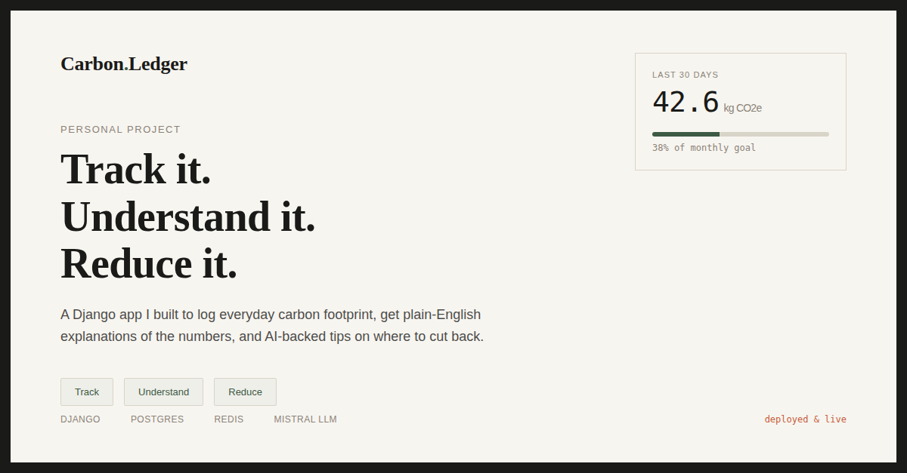

# 🌿 Carbon Footprint Awareness

> **Understand → Track → Reduce** your carbon emissions with AI-powered insights.

[](https://carbon-footprint-awareness-4qpf.onrender.com)
[](./LICENSE)
[](https://djangoproject.com)
[](https://build.nvidia.com)

**🔗 Live Demo: [carbon-footprint-awareness-4qpf.onrender.com](https://carbon-footprint-awareness-4qpf.onrender.com)**

---

## 🌍 What is this?

A full-stack **Carbon Footprint Education Platform** that helps individuals understand, measure, and reduce their environmental impact. Built with Django 5, powered by NVIDIA NIM's LLM for personalized AI insights, and designed for real-world deployment.

---

## ✨ Features

### 📚 Understand
- Lesson articles on climate change, emissions, and sustainability
- Glossary of key terms (CO₂e, Scope 1/2/3, Net Zero, etc.)
- **AI-powered Q&A** — ask any climate question, get an LLM-generated answer (10/day rate limit)

### 📊 Track
- Log daily activities (transport, energy, food, goods)
- Auto-computed CO₂ emissions using verified emission factors
- Dashboard with **Chart.js donut chart** + 30-day category breakdown
- Monthly goal progress bar

### 💡 Reduce
- Rule-based insights vs. national average benchmarks
- Personalized **AI-generated tips** (cached 24h, powered by NVIDIA NIM)
- Recommendations filtered by your top emission categories

---

## 🛠️ Tech Stack

| Layer | Technology |
|---|---|
| Backend | Django 5, Python |
| Frontend | Tailwind CSS (CDN), htmx, Chart.js |
| LLM | NVIDIA NIM — `mistralai/mistral-large-3-675b-instruct-2512` |
| Database | SQLite (dev) / PostgreSQL via `dj-database-url` (prod) |
| Cache | LocMemCache (dev) / Redis via `django-redis` (prod) |
| Server | Gunicorn + WhiteNoise |
| Deployment | Render.com |

---

## 🚀 Getting Started

### Prerequisites
- Python 3.11+
- NVIDIA NIM API key ([get one here](https://build.nvidia.com))

### Local Setup

```bash
# Clone the repo
git clone https://github.com/Divyansh0208/Carbon-Footprint-Awareness.git
cd Carbon-Footprint-Awareness

# Create virtual environment
python -m venv venv
source venv/bin/activate  # Windows: venv\Scripts\activate

# Install dependencies
pip install -r requirements.txt

# Configure environment
cp .env.example .env
# Edit .env and add your NVIDIA NIM API key

# Run migrations + seed data
python manage.py migrate
python manage.py seed_data

# Start the server
python manage.py runserver
```

Visit `http://localhost:8000`

---

## ⚙️ Environment Variables

```env
SECRET_KEY=your-django-secret-key
DEBUG=True
NVIDIA_NIM_API_KEY=your-nvidia-nim-api-key
DATABASE_URL=          # Optional: PostgreSQL URL for prod
REDIS_URL=             # Optional: Redis URL for prod
ADMIN_URL=admin/       # Customize admin path
```

---

## 🧠 LLM Integration (Hallucination Guard)

The LLM is used **only** for Q&A and personalized tips — never for emission calculations (all math is Python/DB).

Safety mechanism:
1. Extracts all numbers from LLM output
2. Verifies every number exists in the provided context
3. If not → retries with "no numbers" instruction
4. If still fails → returns a safe static fallback message

`timeout=10.0`, `max_retries=1` prevent hung worker threads.

---

## 📁 Project Structure

```
Carbon-Footprint-Awareness/
├── carbon_platform/       # Django project settings
├── core/                  # Main app
│   ├── models.py          # 7 models (ActivityLog, Goal, EmissionFactor, ...)
│   ├── views.py           # All views
│   ├── services/
│   │   └── llm.py         # NVIDIA NIM integration with hallucination guard
│   └── management/
│       └── commands/
│           └── seed_data.py  # Seeds emission factors, lessons, glossary
├── templates/             # HTML templates (Tailwind + htmx)
├── requirements.txt
└── README.md
```

---

## 🌱 Emission Factors (Sample)

| Activity | Factor |
|---|---|
| Beef (per kg) | 27 kg CO₂e |
| Short-haul flight (per km) | 0.255 kg CO₂e |
| Car travel (per km) | ~0.21 kg CO₂e |
| Electricity (grid avg, per kWh) | ~0.45 kg CO₂e |

22 factors seeded across transport, energy, food, and goods.

---

## 🧪 Tests

```bash
python manage.py test
```

146 tests · 99% coverage

---

## ⚠️ Known Limitations

- Emission factor values are approximations, not audited scientific figures
- National average benchmarks are placeholders
- LLM calls are synchronous (no Celery/async queue)
- No email verification
- Render free tier: Postgres expires after 90 days

---

## 🤝 Contributing

PRs welcome. For major changes, open an issue first.

1. Fork the repo
2. Create a feature branch (`git checkout -b feature/your-feature`)
3. Commit changes (`git commit -m 'Add your feature'`)
4. Push (`git push origin feature/your-feature`)
5. Open a Pull Request

---

## 📄 License

MIT — see [LICENSE](./LICENSE)

---

## 👤 Author

**Divyansh** — [@Divyansh0208](https://github.com/Divyansh0208)

---

*Built to raise climate awareness, one log at a time. 🌱*
